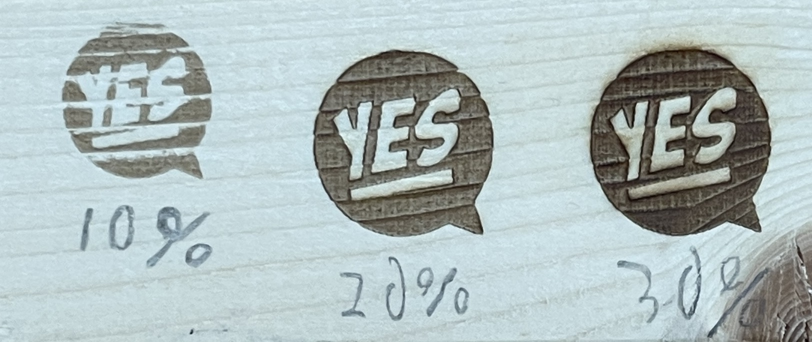
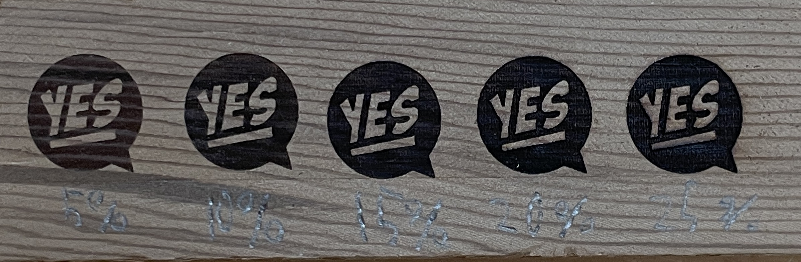
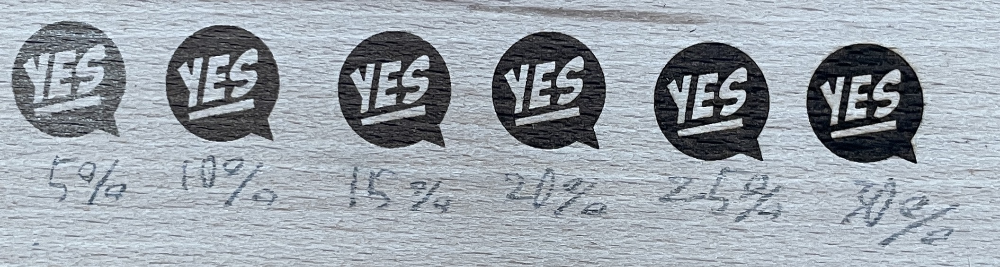

# レーザーペッカーCheetSheet

レーザーペッカーのチートシートを作成する

## 設定
### Settings
### Power : 100%
### 彫刻回数(Number of engravings) : 1
### Depth 5 ~ 30 %

## 注意
 >Depthが強すぎると発火します。\
 >If the depth is too great it will ignite\
 >20%以上だとアプリが警告を出してきます\
 >The app will warn you when it reaches 20% or higher.\

# 木材

## SPF

#### Depth　10~30%(左から10%刻み)
#### Depth　10-30% (10% increments from the left)

## 杉?
### Cedar?

#### Depth　5~25%(左から5%刻み)
#### Depth　5-25% (5% increments from the left)

## タモ?
### Ash

#### Depth　5~30%(左から5%刻み)
#### Depth　5-30% (5% increments from the left)

